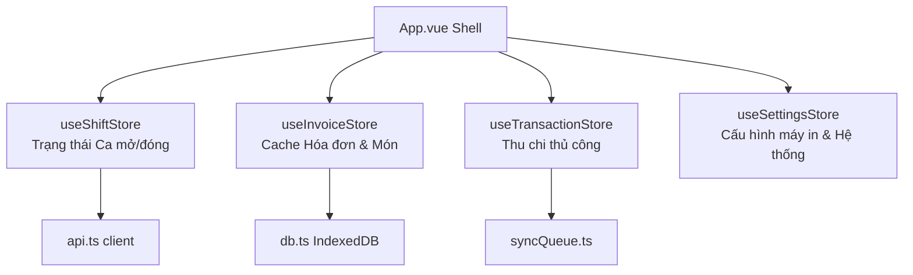

# Kế hoạch Viết lại Webapp KG-Cashier bằng Vue 3 và TypeScript

Tài liệu này phác thảo kế hoạch chi tiết để chuyển đổi (refactor/rewrite) toàn bộ ứng dụng thu ngân **KG-Cashier** từ nền tảng **Vanilla JS (Imperative DOM)** hiện tại sang kiến trúc **Vue 3 (Composition API) + TypeScript + Pinia + Tailwind CSS v4**.

---

## 1. Lý do và Mục tiêu Chuyển đổi

### Hiện trạng & Điểm nghẽn của Vanilla JS
- **Quá tải tệp `store.js`**: Tệp store phình to hơn 2,600 dòng, chứa hỗn hợp nhiều nhiệm vụ: khởi tạo state, quản lý localStorage, đồng bộ đám mây, tính toán tài chính và lưu trữ các mẫu in A4/Receipt khổng lồ.
- **Thao tác DOM thủ công (`innerHTML`, `document.getElementById`)**: Khó bảo trì, dễ phát sinh lỗi rò rỉ bộ nhớ, race condition khi render lại UI, và mất dữ liệu biểu mẫu khi người dùng đang nhập liệu.
- **Không có kiểm soát Type (Kiểu dữ liệu)**: Dữ liệu tài chính (tiền mặt, hóa đơn CUKCUK, giao dịch thu chi) dễ bị sai lệch kiểu dữ liệu (chuỗi vs số), gây lỗi làm tròn dấu phẩy động (`float arithmetic`).
- **Giới hạn localStorage**: Hóa đơn tích lũy nhiều ngày có thể vượt quá giới hạn 5MB của localStorage, gây crash ứng dụng.

### Mục tiêu của Kiến trúc Mới (Vue 3 + TS)
1. **Reactivity & Declarative UI**: Dùng cơ chế reactive của Vue để tự động cập nhật UI khi dữ liệu thay đổi, loại bỏ hoàn toàn các hàm render thủ công.
2. **Type Safety tuyệt đối**: Sử dụng TypeScript để định nghĩa chặt chẽ cấu trúc dữ liệu (`Shift`, `Invoice`, `Transaction`, `Item`), phát hiện lỗi ngay từ lúc viết code.
3. **Quản lý State dạng Modular**: Chia nhỏ `store.js` thành các Pinia stores riêng biệt (`useShiftStore`, `useInvoiceStore`, `useTransactionStore`, `useSettingsStore`).
4. **Tối ưu lưu trữ với IndexedDB**: Sử dụng IndexedDB (thông qua `localforage` hoặc wrapper) để lưu trữ hóa đơn chi tiết, giải phóng localStorage chỉ giữ lại cấu hình nhẹ.
5. **Hiệu năng & Bảo mật**: Tách biệt luồng đồng bộ hóa đơn CUKCUK (kéo delta từ Google Sheets thay vì trình duyệt quét API liên tục), bảo mật token API ở phía Worker/Backend.

---

## 2. So sánh Kiến trúc: Cũ vs. Mới

| Tính năng / Thành phần | Kiến trúc cũ (Vanilla JS) | Kiến trúc mới (Vue 3 + TypeScript) |
| :--- | :--- | :--- |
| **Router / Điều hướng** | Lắng nghe `hashchange` thủ công trong `main.js`, thay thế `container.innerHTML` và gọi hàm `init()`/`destroy()`. | Sử dụng **Vue Router** (`vue-router`), khai báo các routes dạng Single File Components (`.vue`). |
| **State Management** | Biến toàn cục `state`, lưu trữ nguyên khối vào localStorage `kg-cashier-data`, đồng bộ thủ công. | **Pinia Stores** phân rã theo miền nghiệp vụ: `shift`, `invoices`, `transactions`, `settings`, `staff`. |
| **Ràng buộc UI (Data Binding)** | Truy vấn DOM thủ công, gán `.value` hoặc `.textContent`, lắng nghe sự kiện bằng `addEventListener`. | Ràng buộc 2 chiều bằng `v-model`, render danh sách bằng `v-for`, hiển thị điều kiện bằng `v-if` / `v-show`. |
| **Kiểm tra Kiểu (Types)** | Không có. Ép kiểu thủ công bằng các hàm helper như `Number()`, `toMoney()`. | Sử dụng **TypeScript Interfaces** chặt chẽ. Tránh sai sót dữ liệu tài chính đầu vào. |
| **Lưu trữ Cục bộ** | `localStorage` lưu trữ tất cả bao gồm cả snapshots hóa đơn và lịch sử ca lớn, có nguy cơ tràn bộ nhớ. | `localStorage` cho Settings và Session; **IndexedDB** cho bộ nhớ cache hóa đơn chi tiết CUKCUK (`SAInvoices`). |
| **Engine Đồng bộ CUKCUK** | Trình duyệt client trực tiếp gọi CUKCUK Worker Proxy định kỳ 5 phút, dễ bị trùng và nghẽn API. | Backend Job (GAS/Worker) kéo dữ liệu ghi vào Sheets trung tâm. Webapp chỉ kéo dữ liệu phân trang/delta từ Sheets. |

---

## 3. Cấu trúc Thư mục Đề xuất (Vue 3 + TS)

Sử dụng cấu trúc thư mục tiêu chuẩn của Vite + Vue + TS:

```txt
kg-cashier/
├── .wrangler/                  # Wrangler dev files
├── functions/                  # Cloudflare Pages Functions (Proxy CUKCUK, API)
│   └── cukcuk-api/
├── gas/                        # Google Apps Script Backend (cashier_backend.gs)
├── public/                     # Static assets (fonts, icons)
├── src/
│   ├── assets/                 # CSS (Tailwind, fonts), Images
│   │   ├── main.css            # Cấu hình Tailwind CSS v4
│   │   └── fonts.css           # Cấu hình DM Sans & Material Symbols
│   ├── components/             # Reusable UI Components
│   │   ├── common/             # Button, Input, Modal, Toast, Badge
│   │   ├── print/              # Mẫu in hóa đơn A4, mẫu in nhiệt 80mm
│   │   └── widgets/            # ChatbotPanel, SidebarQrWidget, Clock
│   ├── composables/            # Reusable Vue Logic (useFormatter, usePrinter, useTTS)
│   ├── config/                 # Hệ thống hằng số, endpoints và biến môi trường
│   │   ├── endpoints.ts
│   │   └── env.ts
│   ├── router/                 # Cấu hình Vue Router
│   │   └── index.ts
│   ├── services/               # API Client & Offline Sync Engine
│   │   ├── api.ts              # Giao tiếp với Google Apps Script Web App
│   │   ├── db.ts               # Khởi tạo IndexedDB (LocalForage)
│   │   └── syncQueue.ts        # Quản lý hàng đợi ngoại tuyến (Offline Sync Queue)
│   ├── stores/                 # Pinia Stores
│   │   ├── shift.ts            # Quản lý ca (mở, đóng, đối soát)
│   │   ├── invoices.ts         # Lưu trữ và đối soát hóa đơn CUKCUK
│   │   ├── transactions.ts     # Giao dịch thu/chi phát sinh tại quầy
│   │   ├── settings.ts         # Cấu hình hệ thống, khóa VAT, thông tin máy in
│   │   └── staff.ts            # Bộ nhớ cache nhân viên & đăng nhập
│   ├── types/                  # TypeScript Interfaces & Types
│   │   ├── shift.d.ts
│   │   ├── invoice.d.ts
│   │   ├── transaction.d.ts
│   │   ├── settings.d.ts
│   │   └── common.d.ts
│   ├── views/                  # Các màn hình chính (Pages)
│   │   ├── Dashboard.vue
│   │   ├── ShiftManager.vue    # Quản lý ca & Mở/Đóng ca
│   │   ├── Transactions.vue    # Nhật ký giao dịch thu/chi
│   │   ├── CashCount.vue       # Kiểm kê tiền mặt
│   │   ├── DrinkInventory.vue  # Kiểm kho đồ uống
│   │   ├── RevenueReport.vue   # Doanh thu & Báo cáo bán món
│   │   ├── ShiftHistory.vue    # Lịch sử các ca làm việc
│   │   └── Settings.vue        # Cấu hình hệ thống & Thiết lập
│   ├── App.vue                 # Root Component (Chứa Shell, Sidebar, Chatbot)
│   ├── main.ts                 # Điểm khởi chạy ứng dụng (App Entrypoint)
│   └── vite-env.d.ts
├── index.html                  # HTML template chính
├── package.json
├── tsconfig.json               # Cấu hình TypeScript compiler
├── vite.config.ts              # Cấu hình Vite với plugins Vue + TS
└── tailwind.config.js          # Cấu hình Tailwind v4
```

---

## 4. Thiết kế Chi tiết TypeScript & Stores

### 4.1. Định nghĩa Kiểu Dữ liệu Tài chính (`types/`)

Để đảm bảo tính chính xác và tránh lỗi tính toán tiền mặt, chúng ta định nghĩa các Interfaces chặt chẽ cho TypeScript:

#### `types/shift.d.ts`
```typescript
export interface CashCountDetail {
  [denomination: string]: number; // Số tờ của từng mệnh giá (ví dụ: '500000': 12)
}

export interface ShiftSummary {
  totalIncome: number;       // Tổng thu (CUKCUK + Manual Income)
  totalExpense: number;      // Tổng chi
  cashIncome: number;        // Thu tiền mặt
  cardIncome: number;        // Thu thẻ
  transferIncome: number;    // Thu chuyển khoản
  cashExpense: number;       // Chi tiền mặt
  otherIncome: number;       // Thu ngoài ca
  otherExpense: number;      // Chi ngoài ca
  cukcukRevenue: number;     // Doanh thu đồng bộ từ CUKCUK
  cukcukBills: number;       // Số lượng hóa đơn CUKCUK
  billCount: number;         // Tổng số hóa đơn
  expectedCash: number;      // Tiền mặt lý thuyết cuối ca
  manualIncome: number;      // Thu thủ công nhập thêm
  manualBills: number;       // Số lượng hóa đơn thủ công
  revenue: number;           // Doanh thu thuần
  netTotal: number;          // Tiền mặt dự kiến bàn giao
}

export interface Shift {
  id: string;                // shift_yyyy-MM-dd_shiftNumber
  cashierName: string;       // Tên thu ngân trực ca
  shiftNumber: number;       // Số ca (1, 2, ...)
  date: string;              // Ngày làm việc (yyyy-MM-dd)
  startTime: string;         // ISO String thời gian mở ca
  endTime: string | null;    // ISO String thời gian đóng ca
  startingCash: number;      // Tiền mặt đầu ca bàn giao từ ca trước
  transactions: Transaction[]; // Danh sách thu chi phát sinh trong ca
  otherTransactions: Transaction[]; // Giao dịch phụ
  cashCount: CashCountDetail; // Chi tiết kiểm kê tiền mặt thực tế
  cashCountTotal?: number;   // Tổng tiền mặt thực tế kiểm kê
  status: 'open' | 'closed'; // Trạng thái ca
  notes: string;             // Ghi chú ca
  shiftPassword?: string;    // Mật khẩu khóa ca bảo mật
  cashToKeep: number;        // Tiền mặt giữ lại két cho ca sau
  cashToDeposit: number;     // Tiền mặt nộp về cho quản lý
  reopenedAt?: string;       // ISO String thời điểm mở lại ca (nếu có)
  originalSummarySnapshot?: ShiftSummary; // Snapshot số liệu trước khi chỉnh sửa/mở lại ca
  updatedAt: string;         // Thời điểm cập nhật cuối
  version: number;           // Tăng dần để chống ghi đè dữ liệu cũ (Conflict Resolution)
  deviceId: string;          // ID thiết bị ghi dữ liệu cuối
}
```

#### `types/invoice.d.ts`
```typescript
export interface PaymentLine {
  method: 'cash' | 'card' | 'transfer' | 'other';
  amount: number;
}

export interface SAInvoiceDetail {
  itemRowKey: string;        // RefId + '__' + RefDetailID
  refId: string;             // ID hóa đơn cha
  refNo: string;
  refDate: string;
  workDate: string;
  itemId: string;
  itemCode: string;
  itemName: string;
  unitName: string;
  quantity: number;
  unitPrice: number;
  amount: number;
  discountAmount: number;
  isDrink: boolean;          // Đã phân loại là đồ uống
  isFood: boolean;           // Đã phân loại là đồ ăn
}

export interface SAInvoice {
  refId: string;             // Khóa chính đồng bộ duy nhất
  refNo: string;             // Mã hóa đơn CUKCUK
  refDate: string;           // Thời điểm lập hóa đơn
  workDate: string;          // Ngày làm việc tương ứng (quy đổi theo ca)
  amount: number;            // Tổng tiền hóa đơn
  payments: PaymentLine[];   // Chi tiết các dòng thanh toán
  tableName: string;         // Tên bàn
  employeeName: string;      // Nhân viên phục vụ
  status: string;            // Trạng thái hóa đơn
  isPaid: boolean;
  isCancelled: boolean;
  isDeleted: boolean;
  rowHash: string;           // Checksum kiểm tra thay đổi hóa đơn
  itemsCount: number;
  items?: SAInvoiceDetail[]; // Danh sách món chi tiết phục vụ báo cáo/kiểm kho
  manualOverrideJson?: string; // Lưu chỉnh sửa phương thức thanh toán thủ công từ webapp
  manualLock?: boolean;      // Khóa không cho CUKCUK ghi đè khi đã chỉnh tay
}
```

### 4.2. Cấu trúc Stores Pinia

Chúng ta sẽ phân chia logic quản lý trạng thái của `store.js` cũ thành 4 stores chuyên biệt:



#### Ví dụ Store Quản lý Ca (`stores/shift.ts`):
```typescript
import { defineStore } from 'pinia';
import { ref, computed } from 'vue';
import type { Shift, ShiftSummary } from '@/types/shift';
import { api } from '@/services/api';

export const useShiftStore = defineStore('shift', () => {
  const currentShift = ref<Shift | null>(null);
  const shiftHistory = ref<Shift[]>([]);
  const isDirty = ref(false);
  const isSyncing = ref(false);

  // Getters
  const isShiftOpen = computed(() => currentShift.value !== null && currentShift.value.status === 'open');

  // Actions
  async function openNewShift(cashierName: string, shiftNumber: number, date: string, startingCash: number) {
    // 1. Kiểm tra tranh chấp (Lock) trên Sheets
    const registry = await api.checkCloudActiveShift();
    if (registry.success && registry.activeShift) {
      throw new Error(`Đã có ca ${registry.activeShift.shiftNumber} đang mở bởi ${registry.activeShift.cashierName}`);
    }

    // 2. Tạo đối tượng ca mới
    const newShift: Shift = {
      id: `shift_${date}_${shiftNumber}`,
      cashierName,
      shiftNumber,
      date,
      startTime: new Date().toISOString(),
      endTime: null,
      startingCash,
      transactions: [],
      otherTransactions: [],
      cashCount: {},
      status: 'open',
      notes: '',
      cashToKeep: 0,
      cashToDeposit: 0,
      updatedAt: new Date().toISOString(),
      version: 1,
      deviceId: getDeviceId()
    };

    // 3. Ghi atomic lên Sheets qua API
    const response = await api.tryOpenShiftCloud(newShift);
    if (!response.success) {
      throw new Error(response.message || 'Mở ca thất bại trên đám mây');
    }

    currentShift.value = response.shift;
    saveLocalState();
  }

  return {
    currentShift,
    shiftHistory,
    isDirty,
    isSyncing,
    isShiftOpen,
    openNewShift
  };
});
```

---

## 5. Lộ trình Triển khai (Migration Roadmap)

Quá trình viết lại được chia thành 5 giai đoạn cuốn chiếu để đảm bảo ứng dụng luôn có thể chạy thử nghiệm và không làm gián đoạn việc thu ngân tại nhà hàng.

### Giai đoạn 1: Khởi tạo & Cấu hình Build (Dự kiến: 1 ngày)
1. Khởi tạo dự án Vue 3 + TS bằng Vite:
   ```bash
   npx create-vite@latest kg-cashier-vue --template vue-ts
   ```
2. Cấu hình `vite.config.ts`, thêm `@/` path alias và tích hợp Tailwind CSS v4.
3. Thiết lập các tệp cấu hình cốt lõi: `tsconfig.json`, `index.html`.
4. Sao chép phông chữ Be Vietnam Pro/DM Sans, bộ icon VietQR vào `/public`.

### Giai đoạn 2: Phát triển Service, Types & Pinia Stores (Dự kiến: 2 ngày)
1. Viết toàn bộ file định nghĩa kiểu TypeScript (`src/types/`).
2. Viết file `src/services/api.ts` kế thừa các hàm của `api.js` nhưng chuyển sang kiểu TS mạnh (strongly-typed).
3. Thiết lập IndexedDB qua thư viện `localforage` tại `src/services/db.ts`.
4. Viết 4 Pinia stores: `useSettingsStore`, `useShiftStore`, `useInvoiceStore`, `useTransactionStore`.
5. Chuyển đổi logic của `retryQueue.js` thành `src/services/syncQueue.ts` có cơ chế deduplicate và lưu trữ queue vào IndexedDB để an toàn dữ liệu khi offline.

### Giai đoạn 3: Viết lại các View & Shell (Dự kiến: 3 ngày)
1. **App Shell**: Xây dựng `App.vue` chứa thanh menu bên (Sidebar), Header hiển thị đồng hồ thời gian thực và thông tin ca đang hoạt động. Tích hợp Widget QR thanh toán động và Chatbot Trợ lý AI ở góc phải màn hình.
2. **ShiftManager & Unlock Screen**:
   - Giao diện mở ca nhanh (nhập tiền, chọn ca, xác minh PIN).
   - Giao diện khóa màn hình ca (yêu cầu mật khẩu ca khi quay lại thiết bị).
   - Màn hình đóng ca và báo cáo tiền mặt chi tiết cuối ca.
3. **Transactions**:
   - Form thêm nhanh thu/chi (tích hợp phím tắt Alt+T, Alt+C).
   - Bảng nhật ký thu chi phân trang, hỗ trợ lọc loại hình thanh toán.
4. **DrinkInventory**:
   - Giao diện kiểm kho đồ uống cuối ca.
   - Cơ chế tự động đối sánh mã sản phẩm / tên món (`ItemID` từ CUKCUK với `InventoryProductId` của kho) để tính toán tự động số lượng đã bán thực tế.
5. **RevenueReport**:
   - Biểu đồ doanh thu ngày và ca làm việc (sử dụng Chart.js hoặc thư viện nhẹ SVG).
   - **Mới**: Bảng báo cáo số lượng bán món chi tiết phân chia theo đồ ăn / đồ uống dựa trên `KG_CUKCUK_ITEMS` lấy từ Google Sheets.

### Giai đoạn 4: Mẫu in & Tiện ích (Dự kiến: 1 ngày)
1. Chuyển đổi các mẫu in HTML phức tạp trong `printForms.js` thành các Vue Components.
2. Sử dụng scoped CSS để đảm bảo định dạng A4 và hóa đơn nhiệt 80mm luôn hiển thị chuẩn xác khi gọi `window.print()`.
3. Kiểm tra tính năng Text-to-Speech (TTS) đọc loa thông báo thu ngân, gọi món.

### Giai đoạn 5: Tối ưu hiệu năng, Kiểm thử & Deploys (Dự kiến: 1 ngày)
1. **Kiểm thử Đồng bộ Delta**: Đo lường tốc độ kéo dữ liệu hóa đơn từ Google Sheets thông qua index `updatedAt`.
2. **Kiểm thử Xung đột Ca**: Chạy song song 2 thiết bị mô phỏng để đảm bảo API `LockService` trên Google Apps Script chặn đứng tình huống mở trùng ca (Race Condition).
3. **Kiểm thử Hiệu năng Render**: Đảm bảo các tác vụ kéo dữ liệu ngầm không kích hoạt render lại toàn màn hình gây mất focus ở các ô nhập liệu kiểm tiền mặt.
4. **Deploy**: Build bản sản phẩm thông qua Vite và cấu hình deployment pipeline lên Cloudflare Pages.

---

## 6. Điểm cải tiến kỹ thuật quan trọng trong bản Vue 3

### 1. Phép toán Số học Tài chính an toàn
Tránh sử dụng phép cộng trực tiếp số thực (float) trên JavaScript. Toàn bộ các store và helper tính toán tiền tệ sẽ được định nghĩa qua các hàm TypeScript chuẩn xác tuyệt đối:
```typescript
export function addMoney(a: number, b: number): number {
  return Math.round(a) + Math.round(b);
}
export function formatVND(value: number): string {
  return new Intl.NumberFormat('vi-VN', { style: 'currency', currency: 'VND' }).format(value);
}
```

### 2. IndexedDB thay thế localStorage cho Invoices
Tách biệt bộ nhớ:
- `localStorage`: chỉ lưu các thông tin nhẹ như `current_shift_id`, `logged_in_user`, `settings_config` (khoảng < 20KB).
- `IndexedDB`: Sử dụng để lưu trữ hàng nghìn dòng chi tiết hóa đơn CUKCUK. Giúp ứng dụng khởi chạy siêu tốc mà không mất thời gian phân tích cú pháp (JSON.parse) chuỗi localStorage khổng lồ ở đầu ca.

### 3. Tận dụng Reactivity của Vue để chặn Double-Render
Trong phiên bản cũ, các tác vụ chạy nền định kỳ tự động gọi `window.refreshView()`, dễ gây gián đoạn cho thu ngân. Với Vue, chúng ta chỉ cần cập nhật mảng hóa đơn reactive trong store. Chỉ những bảng hiển thị hóa đơn có thay đổi thực tế mới cập nhật lại DOM ở mức độ hạt (Fine-grained reactivity), không hề can thiệp hay giật lag màn hình nhập liệu kiểm kho hay đếm tiền của thủ quỹ.
